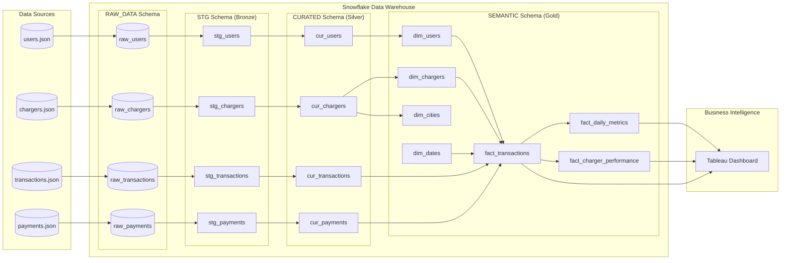
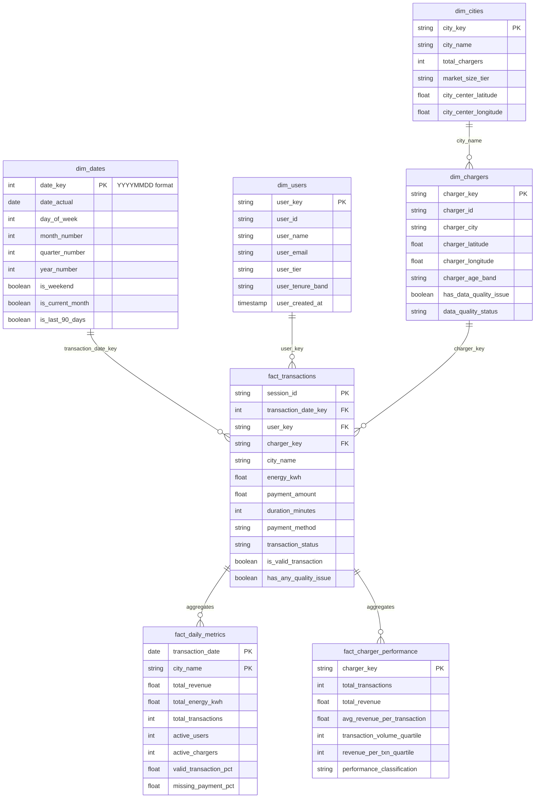
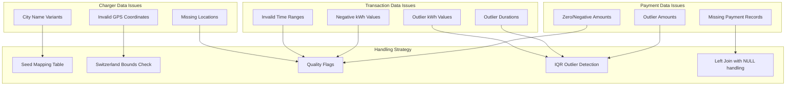

# AutoSense EV Charging Analytics Pipeline

A dbt-based analytics pipeline for EV charging operations, transforming raw JSON data into analytics-ready dimensional models optimized for Tableau dashboards.

## Table of Contents

- [Overview](#overview)
- [Setup Instructions](#setup-instructions)
- [Project Architecture](#project-architecture)
- [Data Model](#data-model)
- [Data Quality Findings](#data-quality-findings)
- [Performance Considerations](#performance-considerations)
- [Production Readiness](#production-readiness)

---

## Overview

This project implements a complete EV charging analytics pipeline using:

- **dbt (Data Build Tool)**: SQL-based transformation framework
- **Snowflake**: Cloud data warehouse
- **Python/Jupyter**: Exploratory data analysis
- **Tableau**: Business intelligence dashboards

### Key Features

- Three-layer medallion architecture (Bronze → Silver → Gold)
- Star schema dimensional model for analytics
- Comprehensive data quality validation and flagging
- Pre-aggregated metrics for dashboard performance

---

## Setup Instructions

### Prerequisites

- Python 3.9+
- dbt-core and dbt-snowflake adapter
- Snowflake account with appropriate permissions
- Git

### 1. Clone the Repository

```bash
git clone https://github.com/ahmed-gharib89/autosense-dbt-task.git
cd autosense-dbt-task
```

### 2. Create Python Environment

```bash
python -m venv .venv
source .venv/bin/activate  # On Windows: .venv\Scripts\activate
pip install -r requirements.txt
```

### 3. Configure dbt Profile

Create `~/.dbt/profiles.yml`:

```yaml
autosense_dbt:
  target: dev
  outputs:
    dev:
      type: snowflake
      account: <your_account>
      user: <your_user>
      password: <your_password>
      role: <your_role>
      database: AUTOSENSE
      warehouse: <your_warehouse>
      schema: DEV
      threads: 4
```

### 4. Load Raw Data into Snowflake

Run the setup script to create database objects and load JSON files:

```bash
# Upload JSON files to Snowflake stage
snowsql -f snowflake/setup_raw_layer.sql
```

### 5. Install dbt Packages

```bash
dbt deps
```

### 6. Build the Pipeline

```bash
# Run all models
dbt build

# Or run specific layers
dbt build --select stage      # Bronze layer
dbt build --select curated    # Silver layer
dbt build --select semantic   # Gold layer (Star Schema)
```

### 7. Generate Documentation

```bash
dbt docs generate
dbt docs serve
```

---

## Project Architecture

### Pipeline Overview



### Layer Descriptions

| Layer      | Schema     | Purpose                                        | Materialization |
| ---------- | ---------- | ---------------------------------------------- | --------------- |
| **Bronze** | `STG`      | Parse JSON, type casting, column renaming      | Table           |
| **Silver** | `CURATED`  | Data cleansing, validation, quality flags      | Table           |
| **Gold**   | `SEMANTIC` | Star schema dimensions and facts for analytics | Table           |

### Directory Structure

```
autosense-dbt-task/
├── analyses/              # Jupyter notebooks for EDA
│   └── eda.ipynb         # Data quality analysis notebook
├── data/                  # Source JSON files
├── models/
│   ├── stage/            # Bronze layer - staging models
│   ├── curated/          # Silver layer - cleaned models
│   └── semantic/         # Gold layer - star schema
├── macros/               # Custom dbt macros
├── seeds/                # Reference data (city mapping)
├── snapshots/            # SCD Type 2 tracking
├── tests/                # Custom data tests
├── snowflake/            # Snowflake setup scripts
└── dbt_project.yml       # dbt configuration
```

---

## Data Model

### Star Schema (Semantic Layer)



### Model Descriptions

#### Dimension Tables

| Model          | Description                               | Key Attributes                                   |
| -------------- | ----------------------------------------- | ------------------------------------------------ |
| `dim_dates`    | Date dimension with time intelligence     | Fiscal periods, relative flags (is_last_90_days) |
| `dim_users`    | User dimension with lifecycle analysis    | Tier, tenure bands, created date                 |
| `dim_chargers` | Charger dimension with location & quality | City, coordinates, age bands, DQ flags           |
| `dim_cities`   | City dimension for geographic analysis    | Market size tier, charger counts                 |

#### Fact Tables

| Model                      | Grain              | Key Measures                                 |
| -------------------------- | ------------------ | -------------------------------------------- |
| `fact_transactions`        | 1 row per session  | energy_kwh, payment_amount, duration_minutes |
| `fact_daily_metrics`       | 1 row per day/city | Aggregated KPIs, DQ percentages              |
| `fact_charger_performance` | 1 row per charger  | Performance quartiles, classification        |

---

## Data Quality Findings

### Summary of Issues Found

The source data contains intentional quality issues. Here's what was identified and how each is handled:



### Detailed Findings

#### 1. Location Data Issues

| Issue                   | Count                                        | Detection Method                                            | Handling                                           |
| ----------------------- | -------------------------------------------- | ----------------------------------------------------------- | -------------------------------------------------- |
| **City name variants**  | Multiple spellings (Zurich, Zuerich, Zürich) | Distinct value analysis                                     | `city_name_mapping` seed table for standardization |
| **Invalid coordinates** | Outside Switzerland bounds                   | Bounding box validation (lat: 45.82-47.81, lon: 5.96-10.49) | `is_invalid_location` flag                         |
| **Missing coordinates** | NULL latitude/longitude                      | NULL check                                                  | `is_invalid_location` flag                         |

#### 2. Transaction Data Issues

| Issue                     | Detection Method                        | Handling                                    |
| ------------------------- | --------------------------------------- | ------------------------------------------- |
| **End time < Start time** | Timestamp comparison                    | `is_invalid_time_range` flag, NULL duration |
| **Negative kWh consumed** | Value < 0 check                         | `is_negative_kwh` flag                      |
| **Outlier kWh values**    | IQR method (Q1 - 1.5×IQR, Q3 + 1.5×IQR) | `is_outlier_kwh` flag                       |
| **Outlier durations**     | IQR method                              | `is_outlier_duration` flag                  |

#### 3. Payment Data Issues

| Issue                       | Detection Method       | Handling                                       |
| --------------------------- | ---------------------- | ---------------------------------------------- |
| **Missing payment records** | LEFT JOIN returns NULL | `is_missing_payment` flag in fact_transactions |
| **Zero/negative amounts**   | Value ≤ 0 check        | `is_invalid_amount` flag                       |
| **Outlier amounts**         | IQR method             | `is_outlier_amount` flag                       |

### Data Quality Approach

**Philosophy**: Flag, don't filter. All records are preserved with quality flags, enabling:

1. **Inclusive reporting**: Show all data, filter in dashboards as needed
2. **Quality monitoring**: Track DQ trends over time
3. **Root cause analysis**: Investigate issues without data loss
4. **Flexible aggregation**: `is_valid_transaction` flag for clean metrics

---

## Performance Considerations

### Materialization Strategy

| Layer        | Materialization | Rationale                                       |
| ------------ | --------------- | ----------------------------------------------- |
| **Stage**    | Table           | Parsed once, read many times by curated layer   |
| **Curated**  | Table           | Complex IQR calculations, quality flag logic    |
| **Semantic** | Table           | Dimensions are small; facts optimized for joins |

### Pre-Aggregated Tables

Two aggregated fact tables reduce Tableau query complexity:

1. **`fact_daily_metrics`**: Pre-computed daily KPIs by city
   - Eliminates complex GROUP BY in dashboards
   - Includes `_ALL_CITIES_` rows for totals

2. **`fact_charger_performance`**: Lifetime charger metrics
   - Performance quartiles pre-calculated
   - Classification logic computed once

### Query Optimization Techniques

- **Denormalized city_name** in fact_transactions for direct filtering
- **Date keys as integers** (YYYYMMDD) for efficient range filtering
- **Boolean quality flags** instead of string status codes
- **Coalesced columns** (\_coalesced suffix) for safe SUM aggregations

### Snowflake-Specific Optimizations

```sql
-- Clustering could be added for large fact tables:
-- ALTER TABLE semantic.fact_transactions CLUSTER BY (transaction_date);

-- Warehouse recommendations:
-- - X-Small for development
-- - Small/Medium for production dashboards
-- - Auto-suspend after 5 minutes
```

---

## Production Readiness

### Current State Assessment

| Aspect                     | Status         | Notes                           |
| -------------------------- | -------------- | ------------------------------- |
| **Data Quality Testing**   | ✅ Ready       | Comprehensive schema.yml tests  |
| **Documentation**          | ✅ Ready       | All models documented           |
| **Materialization**        | ✅ Ready       | Appropriate for data volumes    |
| **Error Handling**         | ✅ Ready       | Quality flags preserve all data |
| **Incremental Processing** | ⚠️ Enhancement | Currently full refresh          |
| **CI/CD**                  | ⚠️ Enhancement | Not configured                  |
| **Monitoring**             | ⚠️ Enhancement | Basic logging only              |

### Recommended Production Enhancements

#### 1. Incremental Models

For large fact tables, convert to incremental:

```sql
{{ config(
    materialized='incremental',
    unique_key='session_id',
    incremental_strategy='merge'
) }}

SELECT ...

WHERE start_time > (SELECT MAX(start_time) FROM {{ this }})

```

#### 2. CI/CD Pipeline

```yaml
# .github/workflows/dbt.yml
name: dbt CI
on: [push, pull_request]
jobs:
  dbt-test:
    runs-on: ubuntu-latest
    steps:
      - uses: actions/checkout@v2
      - run: dbt deps
      - run: dbt build --select state:modified+
      - run: dbt test
```

#### 3. Data Freshness Monitoring

Add source freshness checks:

```yaml
# models/sources.yml
sources:
  - name: raw
    freshness:
      warn_after: { count: 24, period: hour }
      error_after: { count: 48, period: hour }
```

#### 4. Alerting Integration

- Configure Snowflake alerts for failed loads
- Integrate with PagerDuty/Slack for DQ threshold breaches
- Monitor `valid_transaction_pct` dropping below threshold

### Security Considerations

- ✅ No credentials in code
- ✅ Role-based access via Snowflake RBAC
- ⚠️ Recommend: Column-level encryption for PII (email)
- ⚠️ Recommend: Row-level security for multi-tenant scenarios

---

## Running Tests

```bash
# Run all tests
dbt test

# Run tests for specific layer
dbt test --select semantic

# Run only data tests (skip schema tests)
dbt test --select test_type:data
```

### Test Coverage

- **Primary Key Tests**: unique + not_null on all dimension/fact keys
- **Referential Integrity**: relationships tests between facts and dimensions
- **Accepted Values**: payment_method, transaction_status, user_tier
- **Custom Tests**: Quality flag validations

---

## License

This project is part of the AutoSense Data Engineer Assessment.

## Author

Ahmed Gharib - [GitHub](https://github.com/ahmed-gharib89)
